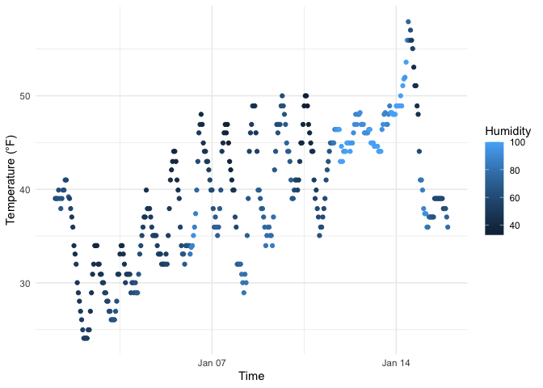

p8105_hw1_xz3499.Rmd
================
Xintong Zhao
2025-9-13

## Problem 1

### 1. Load required libraries

``` r
library(moderndive)
library(ggplot2)
library(dplyr)
```

### 2. Load the dataset

``` r
data("early_january_weather")
```

### 3. View basic dataset information

``` r
# quickly view the data
summary(early_january_weather)
```

    ##     origin               year          month        day              hour      
    ##  Length:358         Min.   :2013   Min.   :1   Min.   : 1.000   Min.   : 0.00  
    ##  Class :character   1st Qu.:2013   1st Qu.:1   1st Qu.: 4.000   1st Qu.: 6.00  
    ##  Mode  :character   Median :2013   Median :1   Median : 8.000   Median :11.50  
    ##                     Mean   :2013   Mean   :1   Mean   : 8.039   Mean   :11.53  
    ##                     3rd Qu.:2013   3rd Qu.:1   3rd Qu.:12.000   3rd Qu.:17.75  
    ##                     Max.   :2013   Max.   :1   Max.   :15.000   Max.   :23.00  
    ##                                                                                
    ##       temp            dewp           humid           wind_dir    
    ##  Min.   :24.08   Min.   : 8.96   Min.   : 32.86   Min.   :  0.0  
    ##  1st Qu.:33.98   1st Qu.:19.94   1st Qu.: 51.34   1st Qu.:140.0  
    ##  Median :39.02   Median :26.06   Median : 61.67   Median :240.0  
    ##  Mean   :39.58   Mean   :28.06   Mean   : 65.48   Mean   :208.2  
    ##  3rd Qu.:44.96   3rd Qu.:35.06   3rd Qu.: 78.68   3rd Qu.:290.0  
    ##  Max.   :57.92   Max.   :53.06   Max.   :100.00   Max.   :360.0  
    ##                                                   NA's   :5      
    ##    wind_speed       wind_gust         precip            pressure   
    ##  Min.   : 0.000   Min.   :16.11   Min.   :0.000000   Min.   :1011  
    ##  1st Qu.: 5.754   1st Qu.:19.56   1st Qu.:0.000000   1st Qu.:1018  
    ##  Median : 8.055   Median :21.86   Median :0.000000   Median :1022  
    ##  Mean   : 8.226   Mean   :22.53   Mean   :0.002039   Mean   :1023  
    ##  3rd Qu.:11.508   3rd Qu.:25.32   3rd Qu.:0.000000   3rd Qu.:1027  
    ##  Max.   :24.166   Max.   :31.07   Max.   :0.190000   Max.   :1034  
    ##                   NA's   :308                        NA's   :38    
    ##      visib          time_hour                  
    ##  Min.   : 0.120   Min.   :2013-01-01 01:00:00  
    ##  1st Qu.: 9.000   1st Qu.:2013-01-04 19:15:00  
    ##  Median :10.000   Median :2013-01-08 12:30:00  
    ##  Mean   : 8.515   Mean   :2013-01-08 12:28:09  
    ##  3rd Qu.:10.000   3rd Qu.:2013-01-12 05:45:00  
    ##  Max.   :10.000   Max.   :2013-01-15 23:00:00  
    ## 

### 4. A short discription of the dataset

The dataset contains the following variables: origin, year, month, day,
hour, temp, dewp, humid, wind_dir, wind_speed, wind_gust, precip,
pressure, visib, time_hour. The important variables include: temp, dewp,
and humid, which are core variables describing the atmospheric state
with relatively uniform distributions; wind_dir and wind_speed, which
are key indicators reflecting wind conditions; precip, which is zero for
most of the time; pressure has a significant number of missing values,
while visib exhibits a wide range of distribution.

The dataset has 358 rows and 15 columns.

The mean temperature is 39.6°F.

### 5. Create scatterplot

``` r
scatter_plot <- ggplot(early_january_weather, aes(x = time_hour, y = temp, color = humid)) +
  geom_point() +
  labs(x = "Time", y = "Temperature (°F)", color = "Humidity") +
  theme_minimal()

# display the plot
print(scatter_plot)
```

<!-- -->

``` r
# save the plot
ggsave("temp_vs_time.png", plot = scatter_plot, width = 8, height = 6)
```

### 6. Apparent patterns in the plot

1.  **Cyclical Temperature Pattern**: The temperature shows obvious
    daily periodic fluctuations. Corresponding to the diurnal cycle, the
    temperature rises during the day and drops at night.

2.  **Humidity-Temperature Relationship**: Generally, there is an
    inversely proportional relationship between temperature and
    humidity. When the temperature is low, the humidity is often high.

3.  **Trend Over Time**: From January 7th to January 15th, the
    temperature generally showed a gradually warming trend.

4.  **Consistent Daily Range**: The daily temperature difference is
    relatively stable during this period.

## Problem 2

### 1. Load required libraries

``` r
library(tidyverse)
```

### 2. Create the dataframe

``` r
set.seed(123)

df <- tibble(
  norm_sample = rnorm(10),
  logical_vec = norm_sample > 0,
  char_vec = letters[1:10],
  factor_vec = factor(rep(c("Low", "Medium", "High"), length.out = 10))
)

print(df)
```

    ## # A tibble: 10 × 4
    ##    norm_sample logical_vec char_vec factor_vec
    ##          <dbl> <lgl>       <chr>    <fct>     
    ##  1     -0.560  FALSE       a        Low       
    ##  2     -0.230  FALSE       b        Medium    
    ##  3      1.56   TRUE        c        High      
    ##  4      0.0705 TRUE        d        Low       
    ##  5      0.129  TRUE        e        Medium    
    ##  6      1.72   TRUE        f        High      
    ##  7      0.461  TRUE        g        Low       
    ##  8     -1.27   FALSE       h        Medium    
    ##  9     -0.687  FALSE       i        High      
    ## 10     -0.446  FALSE       j        Low

### 3. Take the mean of each variable

``` r
# Use pull() to extract each column from the data frame df, calculate the average value of each vector, and store the result in a variable starting with mean_
mean_norm <- mean(pull(df, norm_sample))
mean_logical <- mean(pull(df, logical_vec))
# Use the try() function to catch errors. 
mean_char <- try(mean(pull(df, char_vec)), silent = TRUE)
```

    ## Warning in mean.default(pull(df, char_vec)): argument is not numeric or
    ## logical: returning NA

``` r
mean_factor <- try(mean(pull(df, factor_vec)), silent = TRUE)
```

    ## Warning in mean.default(pull(df, factor_vec)): argument is not numeric or
    ## logical: returning NA

``` r
cat("Mean of norm_sample:", mean_norm, "\n")
```

    ## Mean of norm_sample: 0.07462564

``` r
cat("Mean of logical_vec:", mean_logical, "\n")
```

    ## Mean of logical_vec: 0.5

``` r
cat("Mean of char_vec:", mean_char, "\n")
```

    ## Mean of char_vec: NA

``` r
cat("Mean of factor_vec:", mean_factor, "\n")
```

    ## Mean of factor_vec: NA

### 4. Convert variables to numbers

``` r
num_logical <- as.numeric(pull(df, logical_vec))
num_char <- as.numeric(pull(df, char_vec))
```

    ## Warning: NAs introduced by coercion

``` r
num_factor <- as.numeric(pull(df, factor_vec))
```

- What happens and why?

  - Logical variables: TRUE is converted to 1, and FALSE is converted
    to 0. Because R internally represents logical values in binary.

  - Character variables: Convert all characters to NA. Because
    characters such as letters cannot be parsed into numerical values.

  - Factor variable: Factors are converted to the underlying integer
    codes. Because factors are internally stored as integers
    representing category information in R.

- This helps explain what happens when taking the mean of variables:

  - Numerical variable: The mean is calculated normally.

  - Logical variables: R will automatically convert TRUE/FALSE to 1/0
    before calculation.

  - Character variable: Characters cannot be parsed as numbers, so
    mean() cannot calculate and returns NA.

  - Factor variable: The mean() function does not automatically convert
    factors to their underlying integer codes, resulting in an inability
    to compute the mean.
